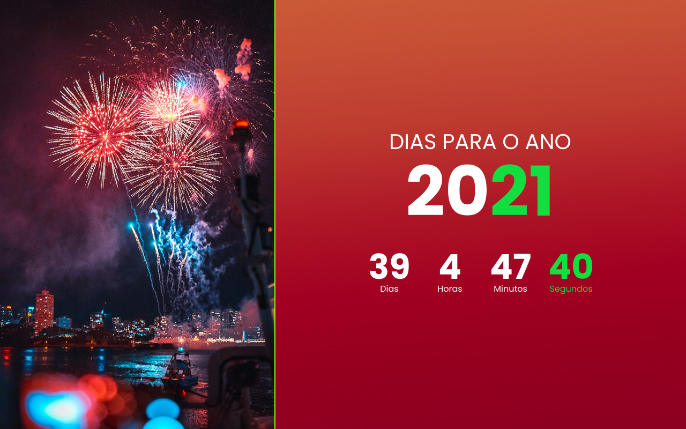

# Contador de dias para o ano novo
Contador de dias para o ano novo js

> Projeto para praticar JavaScript 
> 
> Veja como ficou (https://dias-para-o-ano-novo-6t2s3kond.vercel.app/)

  

## Contributing/Contribuir
Quer contribuir com o projeto? [Confira o passo a passo](./CONTRIBUTING.md)

## Versioning/Versionamento
Esse projeto não possui um sistema de versionamento.

## License/Licença do Projeto
[MIT License](./LICENSE.md)